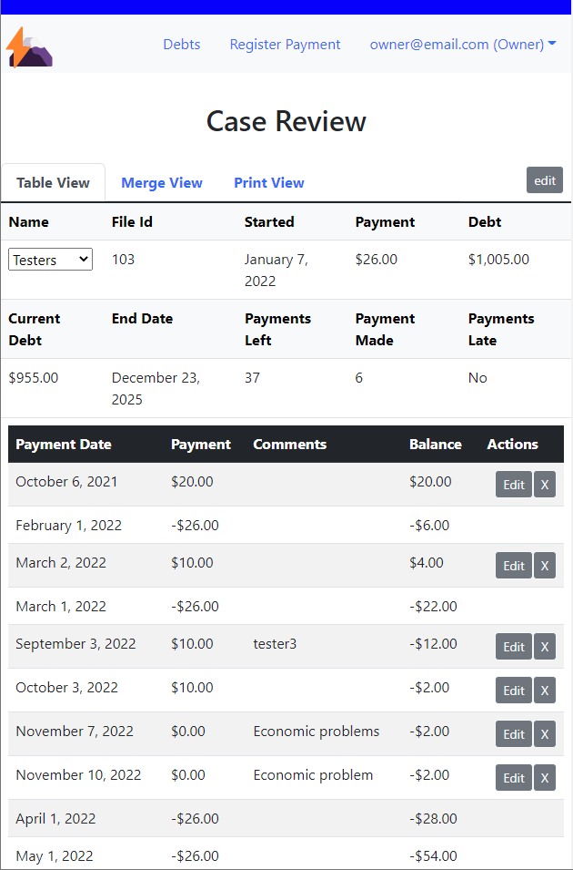

# **Debt Log & Track**

## Description
Track who owes money to the agency. It stores basic information about the person and their debt. It has payment logging and calculates data related to debt. For example, the paid-off amount and the number of payments left.
<!-- Image -->

    

<!--  -->

## Initial Setup
After installation, the owner will need to create the first account. This initial account can only be an owner account. To make it go to the administrator page ( yoururl.com/auth/administrator ). It will only be active if no owner account is present/active.

## Account Types
There are three types of accounts:
1. Owner: This account has total control of all parts of the application and can create, revoke or reset the password of any account type.
2. App Manager: This account is one access level below the owner and is for managing caseworker accounts. They can create or revoke caseworker accounts and can be used to reset passwords for any account (resetting a password does not remove the user's access to the page).
3. Case Worker: This account can only manage debts and payments. It has no access to user accounts.

## User administration
Administrative accounts (Owner and App Mangers) have access to the user administration page. Here they can revoke access, reset passwords and create new user accounts.

It is located in the dropdown next to the user name in the navbar. One of the options will be user administration. Here the administrative accounts can view all account information displayed in a table.

## Creating new accounts
When an admin creates a new account, a link and code appear. It is for the new user to create their password. This code is displayed **only once** and will expire after 3hr. 

The administrator should quickly send it to the new user. A new code can be created by reseting the password for the account.

New user accounts do not have a password associated with them. They will not be able to access the account until they create a password using the link or code. To verify a new user account, go to the page: ( yoururl.com/auth/verifyaccount ).

The application will use the first part of the registered email as the display name for the navbar. Admin accounts will have a pen icon displayed next to their display name.

## Revoking an accounts access
Only certain accounts can revoke other accounts' access; see the table below. To revoke access, first, navigate to the user administration page. The user table will have a revoke button for each account. Just press the button next to the account you wish to revoke. When revoked, the user will no longer be able to log in; but it does not kick the user from the system. **Their current session will remain active until they logout.**

## Reseting a user password
Only certain accounts can reset passwords; see the table below. To reset a password, navigate to the user administration page. In the user table, you will see a button that says reset for each account. Just press the button next to the user to reset the password. A one-time code and link will be displayed. This code is displayed **only once** and will expire after 3hr.

Quickly send it to the user.

Resetting a password will not remove the user's old password. They will still be able to use their password until replaced. Reseting a password gives the user permission to create a new password.

## Permisions and Accounts

### Administrators
- Owner
- App manager

### Who can create what accounts
- Owner: owner, app manager and case worker
- App manager: case worker
- Case worker: none

### Who can reset which password
- Owner: owner, app manager and case worker
- App manager: case worker, self
- Case worker: none

### Who can revoke which account access
- Owner: owner, app manager and case worker
- App manager: case worker
- Case worker: none
** no account can revoke its own access

## Debts
This page displays a summary of all accounts and provides a link to view the complete file.

<!--  -->

## Register / Edit Debt
When registering a debt, all fields are required (name, file id, total debt, minimum payment, start date). File id must be unique for every account since it will identify a person's case, and one person should not have more than one debt. Total debt must be greater than 0, as well as minimum payment. The start day can be any date since a new debt payment may start at a future date, or the caseworker may be registering an old debt.

When editing a debt, the form will verify the new information and make sure the file id is unique; if changed.

## Register / Edit Payment
Registering a payment requires all fields except the comment field (file id, payment amount, date, and comment). The file id must be an existing account id (it populates a list of accounts from the database). Payment must be greater than 0, and the date can not be a future date but can be any past date.

It will check for duplicates. Duplicates are payments with the same id, date, and payment amount. If such payments exist, the case worker would need to add/sum the amount and note it as such in the comments for future reference.

When editing, a form will verify the new information and ensure it is not a duplicate payment.

You can excuse payment by pressing the button under late payment. Allow the debtor to skip the billed amount if justified. 

Excused payments need to have a reason/justification in the comment. The id for the account and the date can not be a future date. 

The debt will still include the excused amount. 

## Case Review
The case review page is available when on the debts page. It displays all the information related to debt (name, file id, start date, minimum payment, total debt, current debt, estimated end date, payments left, payments made, and delinquency/late status), including a breakdown of all payments and bills for the account. 

You can switch between accounts using the dropdown menu under the name. 

The edit button for the debt information is in the top right corner.  

The caseworker can use the button in a late payment to excuse a delinquent bill.

The tabs at the top show the different payment views. It includes an account summary to be printed for the account holder.

### Table
This view list all payments and due bills in ascending order displaying the amount paid or owed, any associated comments, and a running balance. Next to each payment is a delete and edit button.

### Merge
This view divides the table into two sides: payments and bills. Payments will display the date paid, the amount paid, and any comments. Next to it will be a delete and edit button. 

Bills will show the date and paid status; due displays the balance owed. Both will be in ascending order. 

Payments are on the left side and will expand to cover the number of bills that use the amount. 

Bills are on the right side and will expand to include all the payments it uses.

If a payment covers a bill, it will be displayed side by side. If less than a bill, it will be next to it, but the bill will expand to include any other payment needed to cover the whole bill. If it is more than a bill, it will grow to contain all the statements it covers.

For cases when a payment or bill covers or uses just a part of the other, it will expand only halfway into that payment or bill.

### Print View
This view displays information pertinent to the account holder in an accessible format. The information included is: date printed, name, start date, initial balance, minimum payment, amount paid, payoff date, payments made, payment due, the amount owed, and a numbered list of all amounts paid. The payments section includes the date, initial balance, the amount paid, comments, and final balance.

## Dashboard
A table containing data about all the accounts registered. Showing the status of all collections.

<!-- ## Installation -->

## Things to watch out for 
1. This application is ment for small databases. If used with an extensive database then the way data is worked with should be reevaluated to avoid long loading times. You could cache the data locally to avoid calling the database frequently and setting intervals for verifying changes. Also modify calls that use the entire database for only a select amount of data to display.

2. If you requiere the creation of accounts without an administrator then an authentication process should be implemented. Most likely including additional databases to handle authentication and process to avoid abandoned signups.

3. If all owner accounts are remove or revoked then the auth/adminitrator page can be used to create a new owner account. This can be done manually in the database or it might be posible for two owner accounts to revoke each others access while both are login in at the same time.